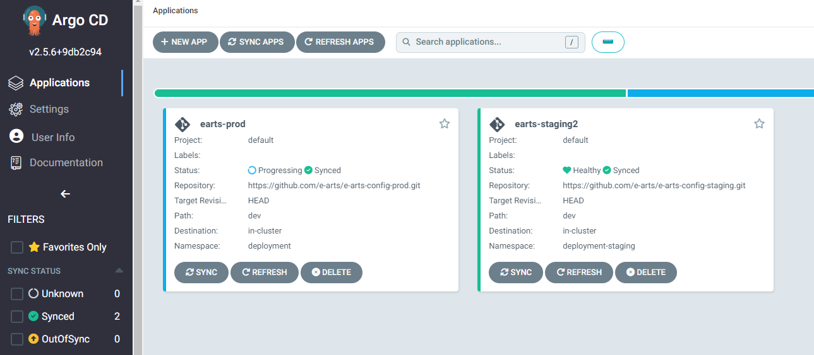
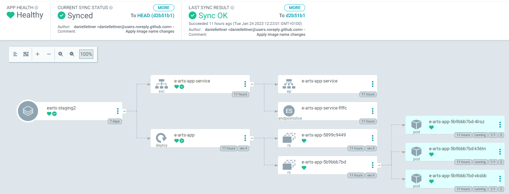

# Continous Deployment workflow with ArgoCD and GKE

## Table of Contents

1. [Introduction](#introduction)
2. [Architecture](#architecture)
3. [Used Technologies](#used-technologies)
4. [Responsibilities](#responsibilities)
5. [Milestones](#milestones)
7. [Continous Deployment workflow with ArgoCD and GKE](#continous-deployment-workflow-with-argocd-and-gke)
    1. [Github Workflow](#github-workflow)
    2. [ArgoCD](#argocd)
    3. [Deployment via Google Cloud (GKE)](#deployment-via-google-cloud-gke)


## Introduction

The goal is to implement a CI/CD Pipeline for the e-arts project. Changes to the main branch or adding a tag should result in tirggering the CI Pipeline. The pipeline consists of linting the project via flake8 and black. Parallel to linting the process for testing the project is executed. If the pipeline is triggered by adding a release tag, the pipeline furthermore builds a new docker images and pushes it onto dockerhub. If release is tagged as prerelease the new Image version is written to the staging environment, otherwise the image is written to the production environment. There are 2 Kubernetes Cluster available: one for production and one for staging. Both environments have ArgoCD installed which is pointing to either the staging or production git repository. Releasing a new version of the "software", results in updating the environments.
 
The pipeline is building in the following way:
1. push onto the main branch / creating a new tag
2. linting the proect. 
3. testing the project via pytest 
4. building a docker image and pushing it to Dockerhub --> after completion, automatic changes in the infrastructure repo
5. ArgoCD detects changes in the config-repo and syncs the new desired state
6. release of the new version in Kubernetes

## Architecture 


## Used Technologies:
- ArgoCD
- Kubernetes
- Github/ Github Actions
- Google Cloud
- Dockerhub
- Docker

## Responsibilities
- Setup of staging and production environment in GKE (@Phillipe Sanio)
- Setup of CI Pipeline (linting, testing) and using (pre-)release capabilities of Github to alter the configuration repositories (@Daniel Lettner)
- Setup of ArgoCD environments in the the staging and production environment to automatically deploy the new (pre-)release versions (@Jakob Pühringer)

## Milestones:
- CI Pipeline
- Kubernetes Environments are setup in Google Cloud
- Automatical deployment via ArgoCD is deployed in the environments
- Presentation of results incl. live demo


## Continous Deployment workflow with ArgoCD and GKE

### Github Workflow


The heart of the CI pipeline is the Github Workflow. On every push or pull request the code gets automatically tested and linted in parallel. The linting process is done via _Black_ and _Flake8_ and the testing is done via _pytest_. In case of an error the actor (user who triggered the workflow) will be notified via e-mail. Furthermore we leverage github releases to automatically deploy the new state of the application via docker and use repository dispatches to change the image version in the respective configuration repositories.

#### 1. Create repositories

   * create a code repository ```e-arts```
   * create 2 configuration repositories ```e-arts-prod``` and ```e-arts-staging```

#### 2. Setup of code repository ```e-arts```

##### Create file ```main.py```

```python
from flask import Flask

app = Flask(__name__)


@app.route("/")
def index():
    return "Hello Release! Updated by Jakob."

if __name__ == "__main__":
    app.run(host="0.0.0.0", port=3000)
```

##### Create ```requirement.txt```

```txt
click==8.1.3
Flask==2.2.2
importlib-metadata==6.0.0
itsdangerous==2.1.2
Jinja2==3.1.2
MarkupSafe==2.1.1
Werkzeug==2.2.2
zipp==3.11.0
```

##### Create dummy testing file under ```test/test.py```

```python
def plus(x: int, y: int) -> int:
    return x + y

def test_plus():
    assert plus(2, 1) == 3
```

##### Create Dockerfile

```Dockerfile
FROM python:3.8-alpine

COPY ./requirements.txt /app/requirements.txt

WORKDIR /app

RUN pip install -r requirements.txt

COPY main.py /app

ENTRYPOINT [ "python" ]

CMD ["main.py" ]
```

##### Create secrets
Secrets can be created under Settings --> Security --> Actions --> New repository secret. The following secrets need to be added for the workflow to work as intended.

   * DOCKERHUB_USERNAME (```Dockerhub username ```)
   * DOCKERHUB_TOKEN (```Dockerhub password```)
   * PAT (```Personal access token```, how to can be read under [Create personal access token](https://docs.github.com/de/authentication/keeping-your-account-and-data-secure/creating-a-personal-access-token))

##### Create Github workflow

<details>
  <summary>Toggle full workflow.yaml</summary>

```yaml
name: CI
on:
  push:
    branches:
        - "**"
  pull_request:
    branches:  
        - "**"
  release:
    types: [published]
  workflow_dispatch:

jobs:

  lint_code:
    name: Code linting
    runs-on: ubuntu-latest

    steps:
      - name: Checkout repository
        uses: actions/checkout@v3
        
      - name: Set up Python
        uses: actions/setup-python@v4
        with:
          python-version: 3.8
      
      - name: Install requirement txt
        run: pip install -r requirements.txt
          
      - name: Install Linting frameworks
        run: pip install black flake8
      
      - name: Run flake8
        run: flake8 .
        
      - name: Run black
        run: black .
      
  test_code:
    name: Code testing
    runs-on: ubuntu-latest
    steps:
      - name: Checkout repository
        uses: actions/checkout@v3
        
      - name: Set up Python
        uses: actions/setup-python@v4
        with:
          python-version: 3.8
      
      - name: Install requirement txt
        run: pip install -r requirements.txt
  
      - name: Install Testing frameworks
        run: pip install pytest
        
      - name: Run Tests
        run: pytest test/test.py
    
  build_and_push:
    if: github.event_name == 'release'
    name: Containerize and Release
    runs-on: ubuntu-latest
    needs: [lint_code, test_code]
    steps:
      - name: Checkout repository
        uses: actions/checkout@v3
        
      - name: Docker meta
        id: meta
        uses: docker/metadata-action@v4
        with:
          images: daniellettner/e-arts
      
      - name: Login to DockerHub
        uses: docker/login-action@v1 
        with:
          username: ${{ secrets.DOCKERHUB_USERNAME }}
          password: ${{ secrets.DOCKERHUB_TOKEN }}
      
      - name: Build and push
        uses: docker/build-push-action@v2
        with:
          context: .
          push: true
          tags: ${{ steps.meta.outputs.tags }}
          labels: ${{ steps.meta.outputs.labels }}
          
      - name: get release tag
        id: vars
        run: echo "tag=${GITHUB_REF#refs/*/}" >> $GITHUB_OUTPUT
        
      - name: Repository Dispatch - Staging
        # always update the staging environment
        uses: peter-evans/repository-dispatch@v1
        with:
          token: ${{ secrets.PAT }}
          repository: e-arts/e-arts-config-staging
          event-type: new-image
          client-payload: '{"image": "daniellettner/e-arts:${{ steps.vars.outputs.tag }}"}'
      
      - name: Repository Dispatch - Production
        if: github.event.release.prerelease == false
        uses: peter-evans/repository-dispatch@v1
        with:
          token: ${{ secrets.PAT }}
          repository: e-arts/e-arts-config-prod
          event-type: new-image
          client-payload: '{"image": "daniellettner/e-arts:${{ steps.vars.outputs.tag }}"}'
```


</details>

<details>
  <summary>Toggle explanation of workflow.yaml</summary>

#### workflow triggers

```yaml
on:
  push:
    branches:
        - "**"
  pull_request:
    branches:  
        - "**"
  release:
    types: [published]
  workflow_dispatch:
```
The workflow should be triggerable via ```push``` or ```pull request``` from any branch. This will be the backbone of the CI pipeline. Furthermore the workflow also listens to the ```github release event```.

##### lint code job

```yaml
 lint_code:
    name: Code linting
    runs-on: ubuntu-latest

    steps:
      - name: Checkout repository
        uses: actions/checkout@v3
        
      - name: Set up Python
        uses: actions/setup-python@v4
        with:
          python-version: 3.8
      
      - name: Install requirement txt
        run: pip install -r requirements.txt
          
      - name: Install Linting frameworks
        run: pip install black flake8
      
      - name: Run flake8
        run: flake8 .
        
      - name: Run black
        run: black .
```

The lint code job is responsible for linting the project and identifying code smells and breaks of conventions. _Black_ and _Flake8_ are used as packages for execution of the linting. 
Detailed explanation:
1. The process is running on ubuntu-latest
2. The process checks out the current repository
3. The process installed the dependencies (Python, packages listed in requirement.txt and the linting packages _Black_ and _Flake8_)
4. The process executes flake8 and black on the root folder

##### test code job

```yaml
test_code:
    name: Code testing
    runs-on: ubuntu-latest
    
    steps:
      - name: Checkout repository
        uses: actions/checkout@v3
        
      - name: Set up Python
        uses: actions/setup-python@v4
        with:
          python-version: 3.8
      
      - name: Install requirement txt
        run: pip install -r requirements.txt
  
      - name: Install Testing frameworks
        run: pip install pytest
        
      - name: Run Tests
        run: pytest test/test.py
```
The test code job is responsible for executing the unit tests of the project. _pytest_ is used as packages for execution of the tests. 
Detailed explanation:
1. The process is running on ubuntu-latest
2. The process checks out the current repository
3. The process installed the dependencies (Python, packages listed in requirement.txt and the pytest package)
4. The process executes pytest on the root folder


##### build and push image job

```yaml
 build_and_push:
    name: Containerize and Release
    runs-on: ubuntu-latest
    needs: [lint_code, test_code]
    if: github.event_name == 'release'
    
    steps:
      - name: Checkout repository
        uses: actions/checkout@v3
        
      - name: Docker meta
        id: meta
        uses: docker/metadata-action@v4
        with:
          images: daniellettner/e-arts
      
      # Login to DockerHub account
      - name: Login to DockerHub
        uses: docker/login-action@v1 
        with:
          username: ${{ secrets.DOCKERHUB_USERNAME }}
          password: ${{ secrets.DOCKERHUB_TOKEN }}
      
      # Build a Docker image based on provided Dockerfile
      - name: Build and push
        uses: docker/build-push-action@v2
        with:
          context: .
          push: true
          tags: ${{ steps.meta.outputs.tags }}
          labels: ${{ steps.meta.outputs.labels }}
          
      - name: get release tag
        id: vars
        run: echo "tag=${GITHUB_REF#refs/*/}" >> $GITHUB_OUTPUT
        
      - name: Repository Dispatch - Staging
        # always update the staging environment
        uses: peter-evans/repository-dispatch@v1
        with:
          token: ${{ secrets.PAT }}
          repository: e-arts/e-arts-config-staging
          event-type: new-image
          client-payload: '{"image": "daniellettner/e-arts:${{ steps.vars.outputs.tag }}"}'
      
      - name: Repository Dispatch - Production
        if: github.event.release.prerelease == false
        uses: peter-evans/repository-dispatch@v1
        with:
          token: ${{ secrets.PAT }}
          repository: e-arts/e-arts-config-prod
          event-type: new-image
          client-payload: '{"image": "daniellettner/e-arts:${{ steps.vars.outputs.tag }}"}'
```

The build and push image job is responsible for containerising the code and pushing it into the docker hub registry. Since it is only triggered via a release, it uses the given tag for the release for tagging the newly created image. Which results in more customisable release and tagging behaviour. Furthermore it leverages the github release and pre-release events. Triggering the pipeline via a pre-release only sends a github repository-dispatch event to the ```e-arts-staging``` repository, whereas a trigger from the github release event also sends a repository-dispatch to the pro ```e-arts-prod``` repository.


Detailed explanation:
1. The process is running on ubuntu-latest
2. The process runs only after the successful completion of the ```lint_code``` and ```test_code``` job
3. The process runs only if the triggering event is a release event. This prevents the job to be executed from a normal ```push``` or ```pull_request``` event
4. The process checks out the current repository
5. The process uses the ```docker/metadata-action@v4``` action to extract the tags from the release. This will create the name for the newly created image including the image name and the tag for versioning. 
6. The process uses ```docker/login-action@v1``` to login into the docker hub account. It uses the secret which were created above.
7. The process builds and pushes the image onto docker hub
8. The process uses the github action ```peter-evans/repository-dispatch@v1``` to execute the repository dispatch to the ```e-arts-staging``` and ```e-arts-prod repository```

</details>

##### 3. Setup of configuration repositories ```e-arts-prod``` and ```e-arts-staging```

Generally speaking ```e-arts-prod``` and ```e-arts-staging``` are setup exactly the same. The only difference between the 2 repositories is the ```repoURL```in the ```application.yaml``` file. 


###### Create ```application.yaml```

```yaml
apiVersion: argoproj.io/v1alpha1
kind: Application
metadata:
  name: e-arts-app-argo-application
  namespace: argocd
spec:
  project: default

  source:
    repoURL: https://github.com/e-arts/e-arts-config-staging.git
    # repoURL: https://github.com/e-arts/e-arts-config-prod.git
    targetRevision: HEAD
    path: dev
  destination: 
    server: https://kubernetes.default.svc
    namespace: e-arts-app

  syncPolicy:
    syncOptions:
    - CreateNamespace=true

    automated:
      selfHeal: true
      prune: true
```

* The repoURL defines the observed repository
* The path defines the folder in the observed repository witch should be synced.
* Pruning the application means that if Argo CD detects that the resource is no longer defined in Git. It will be automatically deleted in the Kubernetes Cluster.
* Self heal means that if Argo CD detects that resources differ from the state declared in Git, it will automatically sync the resource and replace it with the state defined in Git. This prevents manual changes to resources and only allows the state of Git.

###### Create ```deployment.yaml``` under ```/dev``` folder
```yaml
apiVersion: apps/v1
kind: Deployment
metadata:
  name: e-arts-app
spec:
  selector:
    matchLabels:
      app: e-arts-app
  replicas: 3
  template:
    metadata:
      labels:
        app: e-arts-app
    spec:
      containers:
        - name: e-arts-app
          image: "[user]/e-arts:v0.0.1"
          ports:
            - containerPort: 3000
```

Defines the Deployment. It references the image of the container to be deployed and states the port which should be opened for the container. Furthermore it states that the deployment should have 3 replicas.


###### Create ```service.yaml``` under ```/dev``` folder

```yaml
apiVersion: v1
kind: Service
metadata:
  name: e-arts-app-service
spec:
  selector:
    app: e-arts-app
  ports:
  - port: 3000
    protocol: TCP
    targetPort: 3000
  type: LoadBalancer
```

Defines the service to be deployed. It references the resource defined in ```deployment.yaml``` via the app-selector. Furthermore it defines the port on witch the application should be available. To save time and not have to forward the port of the pod to the service after each deployment the type of the service is specified as a load balancer. This has the effect of dynamically link new pods to the service under the specific port. 

##### 4. Testing and triggering the Github pipeline


As defined the ```push``` event should only trigger the ```linting job``` and the ```testing job```, both of which run in parallel. The ```build and push``` job is skipped.


Triggering the pipeline via a release event also triggers the ```build and push``` job. This includes pushing the container to docker hub and creating the repository dispatch, which results in updating the config repositories and specifically the ```deployment.yaml```

```yaml
apiVersion: apps/v1
kind: Deployment
metadata:
  name: e-arts-app
spec:
  selector:
    matchLabels:
      app: e-arts-app
  replicas: 3
  template:
    metadata:
      labels:
        app: e-arts-app
    spec:
      containers:
        - name: e-arts-app
          image: "daniellettner/e-arts:v20.0.1"
          ports:
            - containerPort: 3000
```


### ArgoCD

Argo CD is used as a declarative, continuous delivery tool for Kubernetes and follows the GitOps pattern. The later means that
Git repositories define the desired application state, e.g. when the Git repository differs in the state of the deployed
application, the Git repository is seen as ground truth. Argo CD is a kubernetes controller in order to monitor the current state of our application and
potentially sync it to the desired one (Live state is considered ```OutOfSync```).

The CD-tool creates reports and deployments based on the monitoring so the user knows at all times, how the application's state is defined.
Also, the target environments need to be specified, so automation of deployment can happen.

The general workflow for setting up ArgoCD is desribed in the following:

#### Setup of ArgoCD Deployment in Kubernetes

Setup can be used by local deployment such as Minikube oder Docker Desktop

1. Install ArgoCD
```
 kubectl create namespace argocd
 kubectl apply -n argocd -f https://raw.githubusercontent.com/argoproj/argo-cd/stable/manifests/install.yaml
 ```
 - This creates a new namespace where all further defined resources will live and install the CD tool.

2. Open Port to ArgoCD on local machine
```
 kubectl port-forward svc/argocd-server -n argocd 8080:443
 ```
 - Kubectl port-forwarding in order to access the UI

3. Get username and password: according to documentation username = admin
```
 kubectl -n argocd get secret argocd-initial-admin-secret -o jsonpath=”{.data.password}” | base64 -d; echo
```

4. Browse to http://localhost:8080 to access ArgoUI

Configure ArgoCD to track the config repository.

1. Checkout the e-arts-config git repository
2. Apply the application.yaml to setup the tracking and deploy app
```
 kubectl apply -f application.yaml
 ```
3. Test if application is working (Port should match to flask app)
```
 kubectl port-forward svc/e-arts-app-service 3000:3000 -n e-arts-app
 ```
4. Browse to http://localhost:3000 to access the flask app

After Deploying Argo CD the overview with the already added deployments can look something like this:


For example the deployment of the staging branch looks something like this, in which you can see all components for the specific deployment:


### Deployment via Google Cloud (GKE)
#### Setup of staging and production environment in GKE @Phillipe Sanio

Creating and connecting to the google Kubernetes engine (GKE) can be done in a few steps.
To be able to connect to the GKE you need to install kubectl. This can be done either via a package manager or with
the GCloud installer from Google. Kubectl is used to interact with Kubernetes cluste, which has to be done via the Kubernetes API.
Altough alternatives with a GUI like the program exist, we are using the CLI tool kubectl.

To install kubectl you can use the offical [instructions](https://cloud.google.com/sdk/docs/install) provided by Google.

1. Install GKE and follow instructions: https://dl.google.com/dl/cloudsdk/channels/rapid/GoogleCloudSDKInstaller.exe
2. Initialize GKE
```
gcloud init
``` 
3. Create Project and connect


4. Setup kubernetes cluster in Google Cloud


5. Connect to cluster


6. Repeat steps from [Setup of ArgoCD Deployment in Kubernetes](#setup-of-argocd-deployment-in-kubernetes)

You can view most Kubernetes related features like namespaces, pods, secrets, services, etc. in the WebUI. However, most of the features can be
easily accessed by very short commands, which are often much faster than having to navigate through different menues in the WebUI.

Comands that were useful during this deployment:

If you are unsure to which Kubernetes cluster you are currently connected you can use the following command you get a list of all registerd kubernetes clusters in your kubectl config file and to which you are currently connected (marked with a *)
```
 kubectl config get-contexts
```

To switch the Kubernetes cluster you just have to specify the server context or use the connection string which is provided by the google cloud console in the WebUI.
```
kubectl config use-context your-server-context
```

To get a list of all namespaces (ns):
```
kubectl get ns
```

To get a list of all pods running in a specific namespace use the -n flag or --namspace:
```
kubectl get pods -n your-namespace
```

When you know you are working a specific namespace for a while you can replace the current namespace with another one. This saves you time to not always have to specify the namespace for each interaction. However proceed with caution all commands will be executed within the specified namespace. Even yaml files which do not have the attribute namespace deffined.
```
kubectl config set-context --current --namespace=yournamespace
```

To get all services you can use the shortcut svc. Note: to expose a pod via a port to the outside of the cluster you have to do this via a service. Thus the ip settings are listed when viewing the service for them.
```
kubectl get svc
```
To not always have to expose a pod via port forwarding to the outside of the cluster you can make use of service from the type loadBalancer. This gives you automatically an external IP and lets you route the app via a internal to an external port for the external ip.

```
kubectl patch <SERVICE_NAME> -p '{"spec":{"type":"LoadBalancer"}}'
```
or if you want to specify which port you want to use you can do this with the following command
```
kubectl patch svc <SERVICE_NAME> -p '{"spec": {"ports": [{"port": 443,"targetPort": 443,"name": "https"},{"port": 80,"targetPort": 80,"name": "http"}],"type": "LoadBalancer"}}'
```


